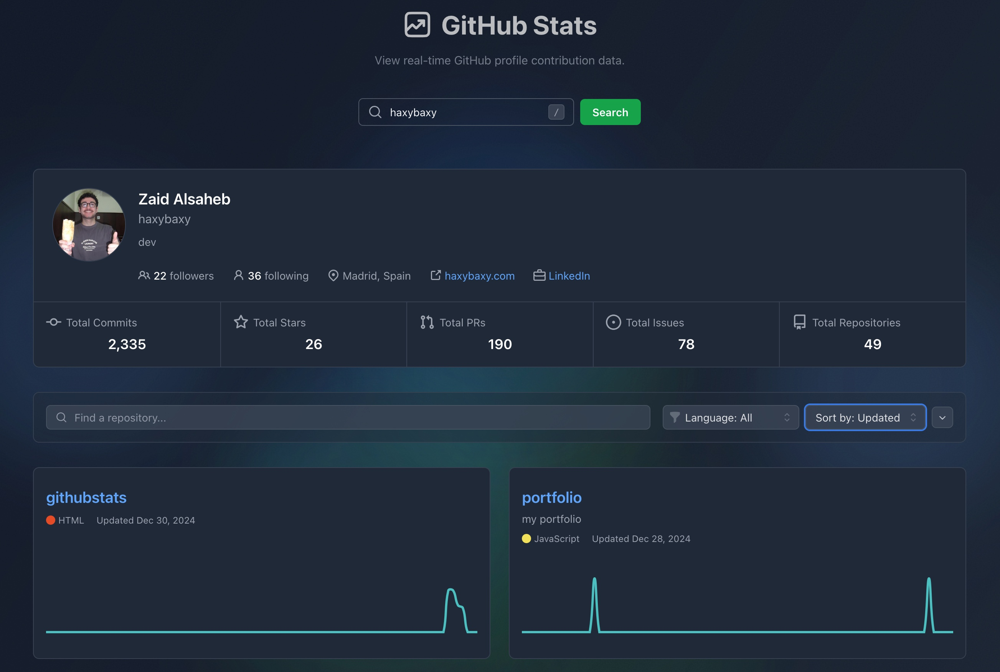

#  GitHub Stats 


Vite React app to view real-time GitHub profile contribution and repository data.

[Deployed Website](https://githubstats-murex.vercel.app/)

[Documentation on Github Pages](https://haxybaxy.github.io/githubstats/)

## Feature

- 📊 Real-time GitHub statistics visualization
- 📈 Interactive contribution graphs
- 📱 Responsive design with dark mode support
- ⚡ Fast and efficient data loading
- 🎨 Beautiful UI with smooth animations
- 🤖 Automatic deployment and testing using Github Actions
- 📚 Documentation deplyed on Github Pages
- 📊 95% Test coverage
- 🚀 Deployed on Vercel


## Tech Stack

- **Frontend Framework**: React 18 with TypeScript
- **Build Tool**: Vite
- **Styling**: TailwindCSS
- **Data Fetching**: Apollo Client (GraphQL)
- **Visualization**: Chart.js
- **Testing**: Jest + React Testing Library
- **Documentation**: Storybook + TypeDoc
- **Animation**: Framer Motion
- **CI/CD and  Automatic Testing**: Github Actions

## Prerequisites

- Node.js 20.x or Docker
- npm 10.x (if running without Docker)
- GitHub Personal Access Token (for API access)

## Steps to Run

### Standard Setup (without Docker)

1. Clone the repository:
```bash
git clone https://github.com/haxybaxy/githubstats.git
cd githubstats
```

2. Install dependencies:
```bash
npm install
```

3. Create a `.env` file in the root directory with your GitHub token (check .env.example for reference):
```bash
VITE_GITHUB_TOKEN=your_token_here
```

4. Start the development server:
```bash
npm run dev
```

5. If you want to fork this and run the workflows, you need to add your access token as GH_TOKEN to your repo secrets. 

The application will be available at `http://localhost:5173`

### Docker Setup

1. Create a `.env` file as described above 
(check .env.example for reference)

2. Build and run with Docker:
```bash
# Build the image
docker build -t githubstats-dev .

# Run the container
docker run -it \
  --env-file .env \
  -p 5173:5173 \
  -v $(pwd):/app \
  -v /app/node_modules \
  gitstats-dev
```

## Testing

### Running Tests

1. Run the entire test suite:
```bash
npm run test
```

2. Run tests in watch mode (for development):
```bash
npm run test:watch
```

3. Generate coverage report:
```bash
npm run test:coverage
```

### Running Storybook

Storybook provides a sandbox environment for developing and testing components in isolation:

```bash
npm run storybook
```


## Future Improvements

1. **Avoiding the Github Rate Limit**
   - A main issue with this app is that the GitHub v4 API has a rate limit of 5000 nodes expanded per hour, rather than requests.
   - To prevent users from hitting the rate limit, I made the decision to only fetch the first 100 commits for a repo in the last 3 months, instead of fully visualizing the commit history.
   - Since you have to expand the nodes to get the date of a commit, we would need to rely on an external webhook to fetch the data.

2. **Snapshot Tests for Commit Line Chart**
   - Due to the nature of the react-chart-js-2 library, you are supposed to mock it with an empty canvas to test that it renders correctly.
   - This means that regular testing with code does not work, so snapshot testing needs to be implemented to test that the chart renders with the correct data.

4. **Versus Mode**
   - The Versus mode is a feature I added to this project to allow users to compare their own stats to another user, you can find the implementation on the comparisonview branch.
   - Some smoother animations and a better mobile UI would need to be implemented before this can be merged into the main branch.

5. **Feature Additions**
   - Adding another query to fetch the amount of open, merged, and closed pull requests or issues for a user would be a nice addition, but I would need to find a more aesthetic way to display the data, in order to not clash with the other user stats.
